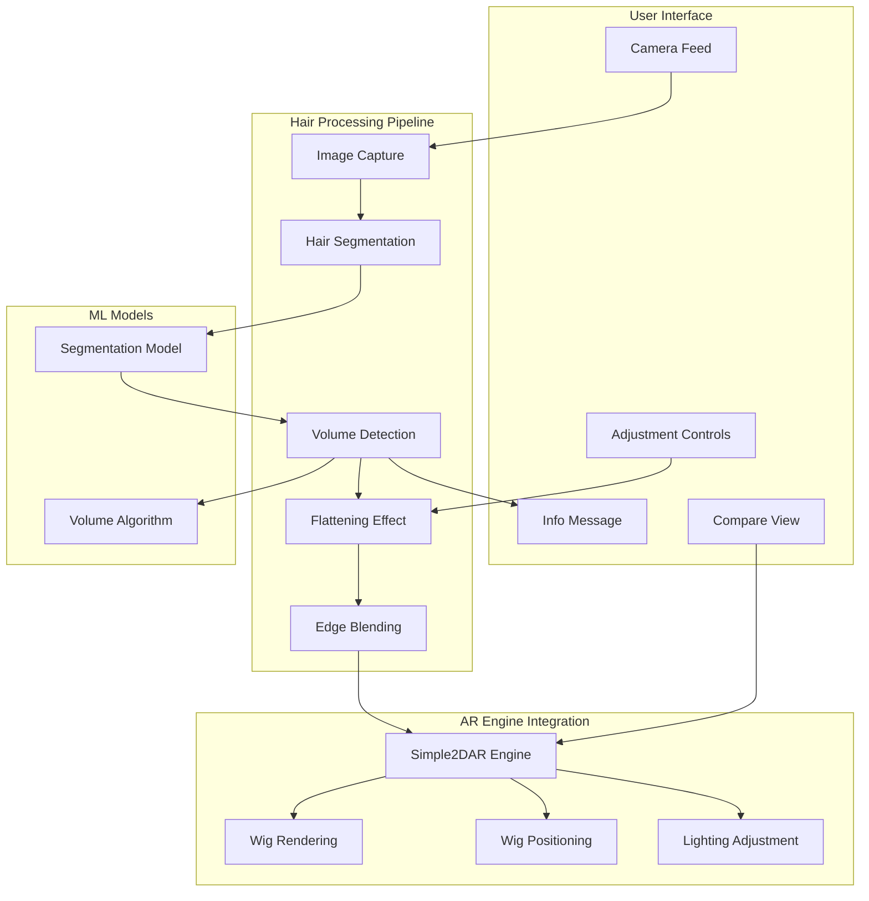

# Design Document: Smart Hair Flattening for AR Wig Try-On

## Overview

The Smart Hair Flattening feature enhances the existing AR wig try-on system by adding AI-powered hair detection and intelligent volume adjustment. This feature addresses a common challenge in virtual try-on experiences: users with voluminous existing hair cannot accurately preview how wigs would look when properly worn with a wig cap. The system uses real-time hair segmentation, soft flattening algorithms, and user-controlled adjustment modes to create realistic, respectful, and accurate wig previews.

### Technology Stack

**AI/ML Components:**
- TensorFlow.js for browser-based inference
- MediaPipe Selfie Segmentation v2 for hair/person segmentation
- Custom hair volume estimation algorithm
- Real-time image processing with WebGL shaders

**Frontend Integration:**
- Extends existing Simple2DAREngine.ts
- React components for adjustment controls
- Canvas-based image manipulation
- WebGL for performance-critical operations

**Performance Targets:**
- Hair segmentation: < 500ms initial detection
- Flattening effect application: < 300ms
- Real-time updates: 15+ FPS for segmentation, 24+ FPS overall
- Memory footprint: < 100MB additional for ML models

## Architecture

### System Architecture




### Data Flow

1. **Initialization Phase:**
   - Load MediaPipe Selfie Segmentation model (~3MB)
   - Initialize WebGL context for shader-based processing
   - Set up canvas layers for compositing

2. **Detection Phase:**
   - Capture frame from camera feed
   - Run segmentation model to identify hair regions
   - Calculate hair volume score (0-100)
   - Determine if auto-flattening should apply (score > 40)

3. **Processing Phase:**
   - Apply selected adjustment mode (Normal/Flattened/Bald)
   - Generate flattened hair mask with edge smoothing
   - Preserve scalp regions and skin tones
   - Apply lighting and shadow adjustments

4. **Rendering Phase:**
   - Composite flattened hair with original image
   - Recalculate wig positioning based on adjusted contours
   - Blend wig edges with adjusted hair regions
   - Render final composite to display canvas

5. **Update Phase:**
   - Monitor for head movement and hair changes
   - Update segmentation at 15+ FPS
   - Maintain smooth transitions during mode changes

## Components and Interfaces

### 1. Hair Segmentation Module

**Responsibilities:**
- Load and initialize MediaPipe Selfie Segmentation model
- Process video frames to identify hair regions
- Generate binary hair masks with confidence scores
- Handle model errors and fallbacks

**Key Classes:**
```typescript
class HairSegmentationModule {
  private model: SelfieSegmentation;
  private segmentationMask: ImageData | null;
  private confidence: number;
  
  async initialize(): Promise<void>;
  async segmentHair(imageData: ImageData): Promise<SegmentationResult>;
  getHairMask(): ImageData | null;
  getConfidence(): number;
  dispose(): void;
}

interface SegmentationResult {
  hairMask: ImageData;
  confidence: number;
  processingTime: number;
}
```


### 2. Hair Volume Detection

**Responsibilities:**
- Analyze hair mask to calculate volume score
- Detect hair density and distribution
- Determine if auto-flattening should trigger
- Provide volume metrics for UI display

**Key Classes:**
```typescript
class HairVolumeDetector {
  calculateVolume(hairMask: ImageData, faceRegion: BoundingBox): VolumeMetrics;
  shouldAutoFlatten(volumeScore: number): boolean;
  getVolumeCategory(): 'minimal' | 'moderate' | 'high' | 'very-high';
}

interface VolumeMetrics {
  score: number; // 0-100
  density: number; // pixels per unit area
  distribution: 'even' | 'concentrated' | 'sparse';
  boundingBox: BoundingBox;
}

interface BoundingBox {
  x: number;
  y: number;
  width: number;
  height: number;
}
```

### 3. Hair Flattening Engine

**Responsibilities:**
- Apply flattening effect based on adjustment mode
- Perform edge smoothing and blending
- Preserve scalp regions and skin tones
- Generate flattened composite images

**Key Classes:**
```typescript
enum AdjustmentMode {
  NORMAL = 'normal',
  FLATTENED = 'flattened',
  BALD = 'bald'
}

class HairFlatteningEngine {
  private mode: AdjustmentMode;
  private blendRadius: number = 5;
  private volumeReduction: number = 0.7; // 70%
  
  setMode(mode: AdjustmentMode): void;
  applyFlattening(
    originalImage: ImageData,
    hairMask: ImageData,
    faceRegion: BoundingBox
  ): Promise<FlattenedResult>;
  
  private flattenHair(image: ImageData, mask: ImageData): ImageData;
  private smoothEdges(image: ImageData, mask: ImageData, radius: number): ImageData;
  private preserveScalp(image: ImageData, mask: ImageData): ImageData;
  private applyBaldEffect(image: ImageData, mask: ImageData): ImageData;
}

interface FlattenedResult {
  flattenedImage: ImageData;
  adjustedMask: ImageData;
  processingTime: number;
  headContour: Point[];
}

interface Point {
  x: number;
  y: number;
}
```


### 4. Wig Alignment Adjuster

**Responsibilities:**
- Recalculate wig positioning based on flattened head contours
- Blend wig edges with adjusted hair regions
- Maintain alignment during head rotation
- Ensure no visible gaps at boundaries

**Key Classes:**
```typescript
class WigAlignmentAdjuster {
  private blendWidth: number = 10;
  
  calculateWigPosition(
    headContour: Point[],
    wigDimensions: Dimensions,
    headPose: HeadPose
  ): WigTransform;
  
  blendWigEdges(
    wigImage: ImageData,
    flattenedBackground: ImageData,
    wigPosition: WigTransform
  ): ImageData;
  
  updateForHeadRotation(
    currentTransform: WigTransform,
    newHeadPose: HeadPose
  ): WigTransform;
  
  validateAlignment(
    wigImage: ImageData,
    background: ImageData,
    transform: WigTransform
  ): AlignmentQuality;
}

interface Dimensions {
  width: number;
  height: number;
}

interface WigTransform {
  position: Point;
  scale: number;
  rotation: number;
  skew: { x: number; y: number };
}

interface AlignmentQuality {
  hasGaps: boolean;
  blendQuality: number; // 0-1
  edgeSmoothn: number; // 0-1
}
```

### 5. Lighting and Shadow Processor

**Responsibilities:**
- Detect ambient lighting from original image
- Apply realistic shadows from wig to hair/scalp
- Match color temperature between regions
- Update shadows dynamically with lighting changes

**Key Classes:**
```typescript
class LightingShadowProcessor {
  detectLighting(image: ImageData): LightingConditions;
  
  applyShadows(
    flattenedImage: ImageData,
    wigMask: ImageData,
    wigPosition: WigTransform,
    lighting: LightingConditions
  ): ImageData;
  
  matchColorTemperature(
    wigRegion: ImageData,
    hairRegion: ImageData,
    targetTemperature: number
  ): ImageData;
  
  updateShadowsForLighting(
    currentImage: ImageData,
    newLighting: LightingConditions
  ): ImageData;
}

interface LightingConditions {
  direction: { x: number; y: number; z: number };
  intensity: number; // 0-1
  colorTemperature: number; // Kelvin
  ambientLevel: number; // 0-1
}
```


### 6. UI Components

**Adjustment Mode Toggle:**
```typescript
interface AdjustmentModeToggleProps {
  currentMode: AdjustmentMode;
  onModeChange: (mode: AdjustmentMode) => void;
  volumeScore: number;
  disabled?: boolean;
}

const AdjustmentModeToggle: React.FC<AdjustmentModeToggleProps> = ({
  currentMode,
  onModeChange,
  volumeScore,
  disabled
}) => {
  // Render three-option toggle with:
  // - Normal
  // - Flattened (recommended) - default if volumeScore > 40
  // - Bald (optional, preview only)
};
```

**Info Message Component:**
```typescript
interface HairAdjustmentMessageProps {
  show: boolean;
  onDismiss: () => void;
  autoHideDuration?: number; // default 4000ms
}

const HairAdjustmentMessage: React.FC<HairAdjustmentMessageProps> = ({
  show,
  onDismiss,
  autoHideDuration = 4000
}) => {
  // Display: "For best results, your hair has been adjusted to fit under the wig. 
  // You can change this below."
  // Include visual indicator pointing to toggle
  // Auto-hide after duration or manual dismiss
};
```

**Comparison View Component:**
```typescript
interface ComparisonViewProps {
  originalImage: ImageData;
  adjustedImage: ImageData;
  currentMode: AdjustmentMode;
  onCapture: (compositeImage: ImageData) => void;
}

const ComparisonView: React.FC<ComparisonViewProps> = ({
  originalImage,
  adjustedImage,
  currentMode,
  onCapture
}) => {
  // Render split-screen view
  // Label "Original" and current mode name
  // Provide capture button for both views
  // Update in real-time as mode changes
};
```

## Data Models

### Segmentation Data

```typescript
interface HairSegmentationData {
  mask: ImageData;
  confidence: number;
  volumeScore: number;
  volumeCategory: 'minimal' | 'moderate' | 'high' | 'very-high';
  boundingBox: BoundingBox;
  timestamp: number;
}
```

### Processing State

```typescript
interface HairProcessingState {
  isInitialized: boolean;
  isProcessing: boolean;
  currentMode: AdjustmentMode;
  segmentationData: HairSegmentationData | null;
  flattenedResult: FlattenedResult | null;
  error: ProcessingError | null;
  performanceMetrics: PerformanceMetrics;
}

interface ProcessingError {
  type: 'SEGMENTATION_FAILED' | 'TIMEOUT' | 'LOW_CONFIDENCE' | 'MODEL_LOAD_FAILED';
  message: string;
  timestamp: number;
}

interface PerformanceMetrics {
  segmentationFPS: number;
  overallFPS: number;
  lastSegmentationTime: number;
  lastFlatteningTime: number;
  memoryUsage: number;
}
```


### User Preferences

```typescript
interface HairAdjustmentPreferences {
  defaultMode: AdjustmentMode;
  autoFlattenThreshold: number; // default 40
  showInfoMessage: boolean;
  enableComparison: boolean;
}
```

## Correctness Properties

*A property is a characteristic or behavior that should hold true across all valid executions of a system—essentially, a formal statement about what the system should do. Properties serve as the bridge between human-readable specifications and machine-verifiable correctness guarantees.*

### Property 1: Segmentation Performance Bound
*For any* valid input image, hair segmentation SHALL complete within 500 milliseconds
**Validates: Requirements 1.1**

### Property 2: Volume Score Range
*For any* segmentation result, the calculated volume score SHALL be between 0 and 100 inclusive
**Validates: Requirements 1.2**

### Property 3: Auto-Flattening Trigger
*For any* volume score, flattening SHALL be automatically applied if and only if the score exceeds 40
**Validates: Requirements 1.3**

### Property 4: Volume Score Display
*For any* completed hair detection, the UI SHALL display the volume score as a visual indicator
**Validates: Requirements 1.4**

### Property 5: Edge Blend Radius
*For any* flattening operation, edge smoothing SHALL use a blend radius of at least 5 pixels
**Validates: Requirements 2.2**

### Property 6: Flattening Performance
*For any* flattening operation, the effect SHALL be applied within 300 milliseconds of volume detection completion
**Validates: Requirements 2.5**

### Property 7: Message Timing
*For any* automatic flattening application, the info message SHALL appear within 200 milliseconds
**Validates: Requirements 3.2**

### Property 8: Message Duration
*For any* displayed info message, it SHALL remain visible for at least 4 seconds unless manually dismissed
**Validates: Requirements 3.3**

### Property 9: Mode Change Performance
*For any* adjustment mode change, the new setting SHALL be applied within 250 milliseconds
**Validates: Requirements 4.5**

### Property 10: Normal Mode Preservation
*For any* input image, selecting Normal mode SHALL result in the original unmodified hair being displayed
**Validates: Requirements 4.2**

### Property 11: Flattening Mode Application
*For any* input image with detected hair, selecting Flattened mode SHALL apply the wig cap simulation effect
**Validates: Requirements 4.3**

### Property 12: Bald Mode Hair Removal
*For any* input image with detected hair, selecting Bald mode SHALL remove all visible hair pixels
**Validates: Requirements 4.4**

### Property 13: Wig Position Recalculation
*For any* flattening effect activation, wig positioning SHALL be recalculated based on the adjusted head contour
**Validates: Requirements 5.1**

### Property 14: Wig Edge Blend Width
*For any* wig rendering with flattening active, edge blending SHALL use a minimum blend width of 10 pixels
**Validates: Requirements 5.2**

### Property 15: Wig Position Update Timing
*For any* adjustment mode change that affects hair volume, wig positioning SHALL update within 200 milliseconds
**Validates: Requirements 5.3**

### Property 16: Gap Prevention
*For any* wig rendering with flattening active, there SHALL be no gaps between wig edges and adjusted hair regions
**Validates: Requirements 5.4**

### Property 17: Head Rotation Alignment
*For any* head rotation up to 45 degrees in any direction, wig alignment SHALL be maintained accurately
**Validates: Requirements 5.5**

### Property 18: Lighting Preservation
*For any* flattening operation, the original lighting direction and intensity SHALL be preserved in the output
**Validates: Requirements 6.1**

### Property 19: Shadow Rendering
*For any* wig rendering with flattening active, shadows SHALL be rendered where the wig would naturally cast them
**Validates: Requirements 6.2**

### Property 20: Color Temperature Matching
*For any* wig and hair region pair, the color temperature difference SHALL be within 500 Kelvin
**Validates: Requirements 6.3**

### Property 21: Shadow Update Timing
*For any* lighting condition change, shadow rendering SHALL update within 100 milliseconds
**Validates: Requirements 6.4**

### Property 22: Shadow Opacity Range
*For any* rendered shadow, opacity SHALL be between 20% and 60% based on ambient lighting intensity
**Validates: Requirements 6.5**

### Property 23: Low Confidence Warning
*For any* segmentation result with confidence below 70%, a warning message SHALL be displayed
**Validates: Requirements 7.5**

### Property 24: Segmentation Frame Rate
*For any* active AR session with head movement, segmentation SHALL update at a minimum of 15 frames per second
**Validates: Requirements 8.1**

### Property 25: Hair Movement Update Timing
*For any* detected hair position change, the flattened region SHALL update within 100 milliseconds
**Validates: Requirements 8.3**

### Property 26: Overall Frame Rate
*For any* AR session with hair segmentation and flattening active, overall frame rate SHALL be at least 24 FPS
**Validates: Requirements 8.4**

### Property 27: Performance Prioritization
*For any* resource-constrained situation, wig rendering SHALL continue while segmentation updates may be reduced
**Validates: Requirements 8.5**

### Property 28: Comparison View Updates
*For any* adjustment mode change in comparison view, both views SHALL update in real-time
**Validates: Requirements 9.3**

### Property 29: Multi-Face Primary Selection
*For any* frame with multiple detected faces, hair adjustment SHALL be applied only to the primary face (largest or most centered)
**Validates: Requirements 10.4**


## Error Handling

### Segmentation Errors

```typescript
class SegmentationErrorHandler {
  handleError(error: ProcessingError): void {
    switch (error.type) {
      case 'MODEL_LOAD_FAILED':
        // Display error message: "Unable to load hair detection. Try refreshing."
        // Fall back to standard AR without hair adjustment
        // Log error for monitoring
        break;
        
      case 'SEGMENTATION_FAILED':
        // Retry segmentation once
        // If retry fails, proceed without hair adjustment
        // Log error with image metadata
        break;
        
      case 'TIMEOUT':
        // Cancel current segmentation
        // Proceed with standard wig rendering
        // Log timeout with performance metrics
        break;
        
      case 'LOW_CONFIDENCE':
        // Display message: "Hair detection confidence is low. Try better lighting."
        // Allow user to proceed with manual mode selection
        // Continue attempting segmentation in background
        break;
    }
  }
}
```

### Edge Case Handling

```typescript
class EdgeCaseHandler {
  handleBaldUser(segmentationData: HairSegmentationData): void {
    // If volumeScore < 5, consider user bald
    // Skip flattening effect
    // Proceed with standard wig rendering
    // Don't show adjustment controls
  }
  
  handleHatDetection(segmentationData: HairSegmentationData): void {
    // Detect unusual segmentation patterns indicating hat/covering
    // Display message: "For best results, please remove head coverings"
    // Allow user to proceed or adjust
  }
  
  handleLowQuality(image: ImageData): void {
    // Check image sharpness and brightness
    // If below threshold, display message:
    // "Image quality is low. Try better lighting or focus."
    // Continue with best-effort segmentation
  }
  
  handleMultipleFaces(faces: BoundingBox[]): BoundingBox {
    // Select largest face by area
    // If multiple faces have similar size, select most centered
    // Return primary face bounding box
  }
}
```

### Performance Degradation

```typescript
class PerformanceManager {
  private targetFPS: number = 24;
  private minSegmentationFPS: number = 15;
  
  monitorPerformance(metrics: PerformanceMetrics): void {
    if (metrics.overallFPS < this.targetFPS) {
      this.degradeGracefully();
    }
  }
  
  private degradeGracefully(): void {
    // Reduce segmentation frequency to maintain wig rendering
    // Lower segmentation resolution if needed
    // Disable real-time comparison view updates
    // Show performance warning to user
  }
  
  recoverPerformance(metrics: PerformanceMetrics): void {
    if (metrics.overallFPS >= this.targetFPS + 5) {
      // Gradually restore full segmentation frequency
      // Re-enable comparison view updates
      // Remove performance warning
    }
  }
}
```


## Testing Strategy

### Unit Testing

**Hair Segmentation Module:**
- Test model initialization and loading
- Verify segmentation output format and dimensions
- Test confidence score calculation
- Verify error handling for invalid inputs
- Test model disposal and cleanup

**Hair Volume Detection:**
- Test volume score calculation with various hair densities
- Verify score stays within 0-100 range
- Test auto-flatten threshold logic (score > 40)
- Verify volume category classification
- Test with edge cases (no hair, full coverage)

**Hair Flattening Engine:**
- Test each adjustment mode (Normal, Flattened, Bald)
- Verify edge smoothing with different blend radii
- Test scalp preservation logic
- Verify processing time meets requirements
- Test mode switching performance

**Wig Alignment Adjuster:**
- Test wig position calculation with various head contours
- Verify blend width meets minimum 10 pixels
- Test alignment during head rotation
- Verify gap detection logic
- Test with different wig dimensions

**Lighting and Shadow Processor:**
- Test lighting detection from various images
- Verify shadow opacity stays within 20-60% range
- Test color temperature matching
- Verify shadow update timing
- Test with different lighting conditions

### Property-Based Testing

The model will use **fast-check** (JavaScript property-based testing library) to verify universal properties across randomly generated inputs.

**Property Test Configuration:**
- Minimum 100 iterations per property test
- Use image generators for diverse test inputs
- Generate various hair volumes, colors, and styles
- Test across different device capabilities

**Key Property Tests:**

**Property 1: Segmentation Performance**
```typescript
// Feature: smart-hair-flattening, Property 1: Segmentation Performance Bound
it('should complete segmentation within 500ms for any valid image', async () => {
  await fc.assert(
    fc.asyncProperty(
      imageGenerator(),
      async (testImage) => {
        const startTime = performance.now();
        await segmentationModule.segmentHair(testImage);
        const duration = performance.now() - startTime;
        expect(duration).toBeLessThan(500);
      }
    ),
    { numRuns: 100 }
  );
});
```

**Property 2: Volume Score Range**
```typescript
// Feature: smart-hair-flattening, Property 2: Volume Score Range
it('should always return volume score between 0 and 100', async () => {
  await fc.assert(
    fc.asyncProperty(
      imageGenerator(),
      async (testImage) => {
        const result = await segmentationModule.segmentHair(testImage);
        const volumeScore = volumeDetector.calculateVolume(result.hairMask, faceRegion).score;
        expect(volumeScore).toBeGreaterThanOrEqual(0);
        expect(volumeScore).toBeLessThanOrEqual(100);
      }
    ),
    { numRuns: 100 }
  );
});
```

**Property 3: Auto-Flattening Trigger**
```typescript
// Feature: smart-hair-flattening, Property 3: Auto-Flattening Trigger
it('should auto-flatten if and only if volume score > 40', async () => {
  await fc.assert(
    fc.asyncProperty(
      imageGenerator(),
      async (testImage) => {
        const result = await segmentationModule.segmentHair(testImage);
        const volumeScore = volumeDetector.calculateVolume(result.hairMask, faceRegion).score;
        const shouldFlatten = volumeDetector.shouldAutoFlatten(volumeScore);
        
        if (volumeScore > 40) {
          expect(shouldFlatten).toBe(true);
        } else {
          expect(shouldFlatten).toBe(false);
        }
      }
    ),
    { numRuns: 100 }
  );
});
```

**Property 10: Normal Mode Preservation**
```typescript
// Feature: smart-hair-flattening, Property 10: Normal Mode Preservation
it('should preserve original image in Normal mode', async () => {
  await fc.assert(
    fc.asyncProperty(
      imageGenerator(),
      async (testImage) => {
        flatteningEngine.setMode(AdjustmentMode.NORMAL);
        const result = await flatteningEngine.applyFlattening(testImage, hairMask, faceRegion);
        
        // Compare pixel data
        expect(result.flattenedImage.data).toEqual(testImage.data);
      }
    ),
    { numRuns: 100 }
  );
});
```


### Integration Testing

**End-to-End AR Flow:**
```typescript
describe('Smart Hair Flattening Integration', () => {
  it('should complete full flow from detection to wig rendering', async () => {
    // Initialize AR engine with hair flattening
    await arEngine.initialize();
    await hairSegmentation.initialize();
    
    // Start camera and detect hair
    const frame = await camera.captureFrame();
    const segResult = await hairSegmentation.segmentHair(frame);
    const volumeScore = volumeDetector.calculateVolume(segResult.hairMask, faceRegion).score;
    
    // Verify auto-flattening triggers
    if (volumeScore > 40) {
      expect(flatteningEngine.getMode()).toBe(AdjustmentMode.FLATTENED);
    }
    
    // Apply flattening and render wig
    const flattened = await flatteningEngine.applyFlattening(frame, segResult.hairMask, faceRegion);
    const wigPosition = alignmentAdjuster.calculateWigPosition(flattened.headContour, wigDims, headPose);
    const final = await arEngine.renderWig(flattened.flattenedImage, wig, wigPosition);
    
    // Verify no gaps and proper blending
    const quality = alignmentAdjuster.validateAlignment(wig, flattened.flattenedImage, wigPosition);
    expect(quality.hasGaps).toBe(false);
    expect(quality.blendQuality).toBeGreaterThan(0.8);
  });
  
  it('should handle mode changes smoothly', async () => {
    // Start with auto-flattened mode
    const initialMode = flatteningEngine.getMode();
    
    // Change to Normal mode
    const startTime = performance.now();
    flatteningEngine.setMode(AdjustmentMode.NORMAL);
    await waitForRender();
    const duration = performance.now() - startTime;
    
    // Verify timing requirement
    expect(duration).toBeLessThan(250);
    
    // Verify original hair is shown
    const currentFrame = arEngine.getCurrentFrame();
    expect(currentFrame).toMatchOriginalHair();
  });
  
  it('should maintain performance during head movement', async () => {
    const fpsMonitor = new FPSMonitor();
    
    // Simulate head movement for 5 seconds
    for (let i = 0; i < 150; i++) { // 30 FPS * 5 seconds
      const frame = await camera.captureFrame();
      await hairSegmentation.segmentHair(frame);
      await flatteningEngine.applyFlattening(frame, hairMask, faceRegion);
      await arEngine.renderFrame();
      
      fpsMonitor.recordFrame();
    }
    
    // Verify frame rate requirements
    expect(fpsMonitor.getAverageFPS()).toBeGreaterThanOrEqual(24);
    expect(fpsMonitor.getSegmentationFPS()).toBeGreaterThanOrEqual(15);
  });
});
```

### Performance Testing

**Benchmarks:**
```typescript
describe('Performance Benchmarks', () => {
  it('should meet segmentation timing requirements', async () => {
    const times: number[] = [];
    
    for (let i = 0; i < 100; i++) {
      const testImage = generateRandomImage();
      const startTime = performance.now();
      await segmentationModule.segmentHair(testImage);
      times.push(performance.now() - startTime);
    }
    
    const avgTime = times.reduce((a, b) => a + b) / times.length;
    const maxTime = Math.max(...times);
    
    expect(avgTime).toBeLessThan(300); // Average well under limit
    expect(maxTime).toBeLessThan(500); // Max meets requirement
  });
  
  it('should meet flattening timing requirements', async () => {
    const times: number[] = [];
    
    for (let i = 0; i < 100; i++) {
      const testImage = generateRandomImage();
      const hairMask = generateRandomMask();
      
      const startTime = performance.now();
      await flatteningEngine.applyFlattening(testImage, hairMask, faceRegion);
      times.push(performance.now() - startTime);
    }
    
    const avgTime = times.reduce((a, b) => a + b) / times.length;
    const maxTime = Math.max(...times);
    
    expect(avgTime).toBeLessThan(200); // Average well under limit
    expect(maxTime).toBeLessThan(300); // Max meets requirement
  });
  
  it('should maintain memory usage under 100MB', async () => {
    const initialMemory = performance.memory.usedJSHeapSize;
    
    // Initialize all modules
    await hairSegmentation.initialize();
    await flatteningEngine.initialize();
    
    // Process 100 frames
    for (let i = 0; i < 100; i++) {
      const frame = generateRandomImage();
      await hairSegmentation.segmentHair(frame);
      await flatteningEngine.applyFlattening(frame, hairMask, faceRegion);
    }
    
    const finalMemory = performance.memory.usedJSHeapSize;
    const memoryIncrease = (finalMemory - initialMemory) / (1024 * 1024); // MB
    
    expect(memoryIncrease).toBeLessThan(100);
  });
});
```


### User Acceptance Testing

**Test Scenarios:**

1. **Diverse Hair Types:**
   - Test with users having different hair colors (black, brown, blonde, red, gray, dyed colors)
   - Test with different hair textures (straight, wavy, curly, coily)
   - Test with different hair volumes (short, medium, long, voluminous)
   - Test with different hairstyles (loose, ponytail, braids, buns)

2. **Edge Cases:**
   - Bald users (should skip flattening)
   - Users wearing hats or head coverings (should show message)
   - Users with partially visible hair
   - Users with hair accessories (clips, headbands)

3. **Lighting Conditions:**
   - Bright indoor lighting
   - Dim indoor lighting
   - Natural outdoor lighting
   - Mixed lighting sources
   - Backlighting scenarios

4. **Device Compatibility:**
   - Desktop browsers (Chrome, Firefox, Safari, Edge)
   - Mobile browsers (iOS Safari, Android Chrome)
   - Different camera qualities
   - Different screen sizes and resolutions

5. **User Experience:**
   - Clarity of adjustment mode labels
   - Effectiveness of info message
   - Usefulness of comparison view
   - Naturalness of flattened appearance
   - Accuracy of wig alignment

## Security and Privacy

### Camera Data Handling

**Privacy Principles:**
- All hair segmentation processing occurs locally in the browser
- No camera frames or hair data are sent to servers
- Segmentation models run entirely client-side
- User can disable camera access at any time

**Data Retention:**
```typescript
class PrivacyManager {
  clearCameraData(): void {
    // Clear all video frames from memory
    // Dispose segmentation results
    // Clear canvas buffers
    // Release camera stream
  }
  
  handleSessionEnd(): void {
    // Automatically clear all camera data when AR session ends
    // Clear any cached segmentation results
    // Reset adjustment preferences if not saved
  }
}
```

### Model Security

**Model Integrity:**
- Load MediaPipe models from official CDN with SRI (Subresource Integrity)
- Verify model checksums before initialization
- Handle model loading failures gracefully
- No custom or third-party segmentation models

```typescript
const MODEL_CONFIG = {
  url: 'https://cdn.jsdelivr.net/npm/@mediapipe/selfie_segmentation@0.1/selfie_segmentation.js',
  integrity: 'sha384-...', // SRI hash
  fallbackUrl: 'https://backup-cdn.example.com/selfie_segmentation.js'
};
```

## Performance Optimization

### WebGL Acceleration

**Shader-Based Processing:**
```glsl
// Hair flattening fragment shader
precision mediump float;

uniform sampler2D u_image;
uniform sampler2D u_hairMask;
uniform float u_flattenAmount; // 0.0 to 1.0
uniform float u_blendRadius;

varying vec2 v_texCoord;

void main() {
  vec4 originalColor = texture2D(u_image, v_texCoord);
  float hairMaskValue = texture2D(u_hairMask, v_texCoord).r;
  
  // Apply flattening effect
  vec4 flattenedColor = originalColor * (1.0 - hairMaskValue * u_flattenAmount);
  
  // Edge smoothing
  float smoothedMask = smoothstep(0.0, u_blendRadius, hairMaskValue);
  
  gl_FragColor = mix(originalColor, flattenedColor, smoothedMask);
}
```

### Memory Management

**Efficient Buffer Handling:**
```typescript
class BufferManager {
  private imageBuffers: Map<string, ImageData> = new Map();
  private maxBuffers: number = 5;
  
  getBuffer(key: string, width: number, height: number): ImageData {
    if (!this.imageBuffers.has(key)) {
      if (this.imageBuffers.size >= this.maxBuffers) {
        // Remove oldest buffer
        const firstKey = this.imageBuffers.keys().next().value;
        this.imageBuffers.delete(firstKey);
      }
      this.imageBuffers.set(key, new ImageData(width, height));
    }
    return this.imageBuffers.get(key)!;
  }
  
  clearBuffers(): void {
    this.imageBuffers.clear();
  }
}
```

### Progressive Enhancement

**Adaptive Quality:**
```typescript
class AdaptiveQualityManager {
  private currentQuality: 'high' | 'medium' | 'low' = 'high';
  
  adjustQuality(performanceMetrics: PerformanceMetrics): void {
    if (performanceMetrics.overallFPS < 20) {
      this.currentQuality = 'low';
      this.applyLowQualitySettings();
    } else if (performanceMetrics.overallFPS < 24) {
      this.currentQuality = 'medium';
      this.applyMediumQualitySettings();
    } else {
      this.currentQuality = 'high';
      this.applyHighQualitySettings();
    }
  }
  
  private applyLowQualitySettings(): void {
    // Reduce segmentation resolution to 256x256
    // Lower segmentation frequency to 10 FPS
    // Disable real-time comparison view
    // Reduce blend radius to 3 pixels
  }
  
  private applyMediumQualitySettings(): void {
    // Use segmentation resolution 384x384
    // Maintain segmentation at 15 FPS
    // Enable comparison view with lower update rate
    // Use blend radius of 5 pixels
  }
  
  private applyHighQualitySettings(): void {
    // Full segmentation resolution 512x512
    // Segmentation at 20+ FPS
    // Full real-time comparison view
    // Full blend radius of 10 pixels
  }
}
```

## Deployment Considerations

### Model Loading Strategy

**Lazy Loading:**
- Load segmentation model only when user activates AR try-on
- Show loading indicator during model initialization
- Cache model in browser for subsequent sessions
- Provide offline fallback message if model fails to load

**CDN Configuration:**
```typescript
const CDN_CONFIG = {
  primary: 'https://cdn.jsdelivr.net/npm/@mediapipe/selfie_segmentation',
  fallback: 'https://unpkg.com/@mediapipe/selfie_segmentation',
  timeout: 10000, // 10 seconds
  retries: 2
};
```

### Browser Compatibility

**Feature Detection:**
```typescript
class CompatibilityChecker {
  checkCompatibility(): CompatibilityResult {
    const result: CompatibilityResult = {
      isCompatible: true,
      missingFeatures: [],
      warnings: []
    };
    
    // Check WebGL support
    if (!this.hasWebGL()) {
      result.isCompatible = false;
      result.missingFeatures.push('WebGL');
    }
    
    // Check camera access
    if (!navigator.mediaDevices?.getUserMedia) {
      result.isCompatible = false;
      result.missingFeatures.push('Camera Access');
    }
    
    // Check TensorFlow.js support
    if (!this.hasTensorFlowSupport()) {
      result.isCompatible = false;
      result.missingFeatures.push('TensorFlow.js');
    }
    
    // Check performance capabilities
    if (this.isLowEndDevice()) {
      result.warnings.push('Performance may be limited on this device');
    }
    
    return result;
  }
}

interface CompatibilityResult {
  isCompatible: boolean;
  missingFeatures: string[];
  warnings: string[];
}
```

### Monitoring and Analytics

**Key Metrics to Track:**
- Hair segmentation success rate
- Average segmentation time
- Average flattening time
- Overall FPS distribution
- Mode selection preferences (Normal/Flattened/Bald)
- Error rates by type
- Browser/device compatibility issues
- User engagement with comparison view

```typescript
interface AnalyticsEvent {
  eventType: 'segmentation_complete' | 'mode_change' | 'error' | 'performance_degradation';
  timestamp: number;
  data: Record<string, any>;
}

class AnalyticsTracker {
  trackSegmentation(duration: number, volumeScore: number, confidence: number): void {
    this.sendEvent({
      eventType: 'segmentation_complete',
      timestamp: Date.now(),
      data: { duration, volumeScore, confidence }
    });
  }
  
  trackModeChange(fromMode: AdjustmentMode, toMode: AdjustmentMode): void {
    this.sendEvent({
      eventType: 'mode_change',
      timestamp: Date.now(),
      data: { fromMode, toMode }
    });
  }
  
  trackError(error: ProcessingError): void {
    this.sendEvent({
      eventType: 'error',
      timestamp: Date.now(),
      data: { errorType: error.type, message: error.message }
    });
  }
}
```
