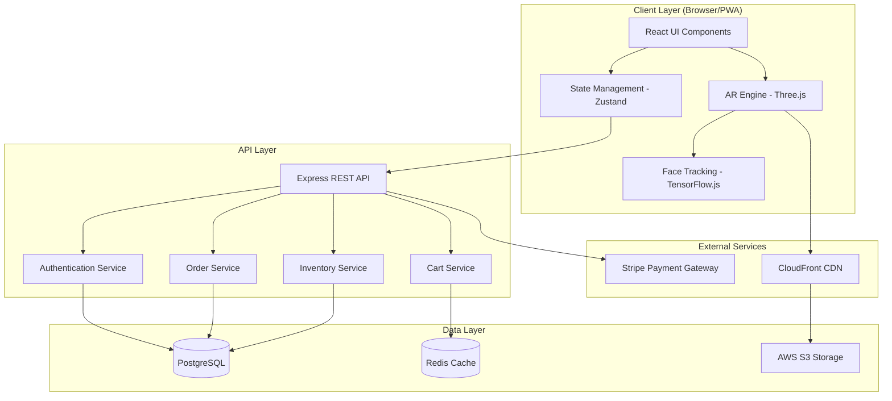

# Design Document: Spooky Styles AR Store

## Overview

Spooky Styles is a web-based Halloween e-commerce platform built as a Progressive Web App (PWA) that combines WebXR/WebGL-based AR try-on capabilities with a full-featured online store. The architecture follows a modern client-server model with a React-based frontend, Node.js backend API, and cloud-based services for payments and media storage.

### Technology Stack

**Frontend:**
- React 18+ with TypeScript for UI components
- Three.js + React Three Fiber for 3D rendering
- TensorFlow.js with MediaPipe Face Mesh for face tracking
- Zustand for state management
- TailwindCSS for styling with custom Halloween theme
- PWA capabilities for mobile installation

**Backend:**
- Node.js with Express.js REST API
- PostgreSQL for relational data (products, orders, users)
- Redis for session management and caching
- AWS S3 for 3D model and image storage
- Stripe API for payment processing

**Infrastructure:**
- Docker containers for deployment
- AWS/Vercel for hosting
- CloudFront CDN for asset delivery

## Architecture

### High-Level System Architecture




## Components and Interfaces

### Frontend Components

#### 1. AR Try-On Engine

**Responsibilities:**
- Initialize and manage Three.js scene with camera and lighting
- Load and render 3D wig models (GLTF/GLB format)
- Apply real-time transformations based on face tracking data
- Handle color customization via material property updates
- Manage accessory layering with proper z-ordering

**Key Classes:**
```typescript
class ARTryOnEngine {
  scene: THREE.Scene;
  camera: THREE.PerspectiveCamera;
  renderer: THREE.WebGLRenderer;
  
  initializeScene(): void;
  loadWigModel(modelUrl: string): Promise<THREE.Group>;
  updateWigPosition(faceData: FaceLandmarks): void;
  applyColorCustomization(color: string): void;
  addAccessoryLayer(accessory: THREE.Group, layer: number): void;
  removeAccessoryLayer(layer: number): void;
  captureScreenshot(): Promise<Blob>;
}
```

#### 2. Face Tracking Module

**Responsibilities:**
- Initialize MediaPipe Face Mesh model
- Process video stream from device camera
- Extract 468 facial landmarks in real-time
- Calculate head pose (rotation, translation)
- Detect lighting conditions

**Key Classes:**
```typescript
class FaceTrackingModule {
  model: FaceMesh;
  videoElement: HTMLVideoElement;
  
  initialize(): Promise<void>;
  startTracking(): void;
  stopTracking(): void;
  getFaceLandmarks(): FaceLandmarks | null;
  getHeadPose(): HeadPose;
  detectLightingConditions(): LightingData;
}

interface FaceLandmarks {
  points: Array<{x: number, y: number, z: number}>;
  confidence: number;
}

interface HeadPose {
  rotation: {x: number, y: number, z: number};
  translation: {x: number, y: number, z: number};
}
```

#### 3. Product Catalog Component

**Responsibilities:**
- Display product grid with filtering and search
- Handle category navigation
- Show product details and pricing
- Manage wishlist functionality
- Display costume inspiration galleries

**Component Structure:**
```typescript
interface Product {
  id: string;
  name: string;
  description: string;
  price: number;
  promotionalPrice?: number;
  category: string;
  theme: 'witch' | 'zombie' | 'vampire' | 'skeleton' | 'ghost';
  modelUrl: string;
  thumbnailUrl: string;
  colors: string[];
  stockQuantity: number;
  isAccessory: boolean;
}

interface CatalogProps {
  products: Product[];
  onProductSelect: (product: Product) => void;
  onTryOn: (product: Product) => void;
  filters: FilterOptions;
}
```


#### 4. Shopping Cart & Checkout

**Responsibilities:**
- Manage cart state with product customizations
- Calculate totals with taxes
- Handle quantity updates
- Integrate with Stripe for payment processing
- Display order confirmation

**State Management:**
```typescript
interface CartItem {
  productId: string;
  quantity: number;
  customizations: {
    color?: string;
    accessories?: string[];
  };
  price: number;
}

interface CartStore {
  items: CartItem[];
  addItem: (item: CartItem) => void;
  removeItem: (productId: string) => void;
  updateQuantity: (productId: string, quantity: number) => void;
  clearCart: () => void;
  getTotal: () => number;
}
```

#### 5. User Account Management

**Responsibilities:**
- Handle registration and login
- Manage user sessions
- Display order history
- Store user preferences

**API Integration:**
```typescript
interface UserService {
  register(email: string, password: string, name: string): Promise<User>;
  login(email: string, password: string): Promise<AuthToken>;
  logout(): Promise<void>;
  getOrderHistory(): Promise<Order[]>;
  updateProfile(updates: Partial<User>): Promise<User>;
}

interface User {
  id: string;
  email: string;
  name: string;
  createdAt: Date;
}

interface Order {
  id: string;
  userId: string;
  items: CartItem[];
  total: number;
  status: 'pending' | 'processing' | 'shipped' | 'delivered';
  createdAt: Date;
}
```

### Backend API Endpoints

#### Authentication Endpoints
```
POST   /api/auth/register          - Create new user account
POST   /api/auth/login             - Authenticate user
POST   /api/auth/logout            - Invalidate session
GET    /api/auth/me                - Get current user info
```

#### Product Endpoints
```
GET    /api/products               - List all products (with filters)
GET    /api/products/:id           - Get product details
POST   /api/products               - Create product (admin)
PUT    /api/products/:id           - Update product (admin)
DELETE /api/products/:id           - Delete product (admin)
GET    /api/products/search        - Search products by keyword
```

#### Cart Endpoints
```
GET    /api/cart                   - Get current cart
POST   /api/cart/items             - Add item to cart
PUT    /api/cart/items/:id         - Update cart item
DELETE /api/cart/items/:id         - Remove cart item
DELETE /api/cart                   - Clear cart
```

#### Order Endpoints
```
POST   /api/orders                 - Create order from cart
GET    /api/orders                 - Get user's order history
GET    /api/orders/:id             - Get order details
PUT    /api/orders/:id/status      - Update order status (admin)
```

#### Payment Endpoints
```
POST   /api/payments/intent        - Create Stripe payment intent
POST   /api/payments/confirm       - Confirm payment completion
```


## Data Models

### Database Schema (PostgreSQL)

#### Users Table
```sql
CREATE TABLE users (
  id UUID PRIMARY KEY DEFAULT gen_random_uuid(),
  email VARCHAR(255) UNIQUE NOT NULL,
  password_hash VARCHAR(255) NOT NULL,
  name VARCHAR(255) NOT NULL,
  created_at TIMESTAMP DEFAULT CURRENT_TIMESTAMP,
  updated_at TIMESTAMP DEFAULT CURRENT_TIMESTAMP,
  failed_login_attempts INT DEFAULT 0,
  account_locked_until TIMESTAMP NULL
);
```

#### Products Table
```sql
CREATE TABLE products (
  id UUID PRIMARY KEY DEFAULT gen_random_uuid(),
  name VARCHAR(255) NOT NULL,
  description TEXT,
  price DECIMAL(10, 2) NOT NULL,
  promotional_price DECIMAL(10, 2) NULL,
  category VARCHAR(100) NOT NULL,
  theme VARCHAR(50) NOT NULL,
  model_url VARCHAR(500) NOT NULL,
  thumbnail_url VARCHAR(500) NOT NULL,
  stock_quantity INT NOT NULL DEFAULT 0,
  is_accessory BOOLEAN DEFAULT FALSE,
  created_at TIMESTAMP DEFAULT CURRENT_TIMESTAMP,
  updated_at TIMESTAMP DEFAULT CURRENT_TIMESTAMP
);
```

#### Product Colors Table
```sql
CREATE TABLE product_colors (
  id UUID PRIMARY KEY DEFAULT gen_random_uuid(),
  product_id UUID REFERENCES products(id) ON DELETE CASCADE,
  color_name VARCHAR(50) NOT NULL,
  color_hex VARCHAR(7) NOT NULL,
  UNIQUE(product_id, color_name)
);
```

#### Orders Table
```sql
CREATE TABLE orders (
  id UUID PRIMARY KEY DEFAULT gen_random_uuid(),
  user_id UUID REFERENCES users(id) ON DELETE SET NULL,
  total DECIMAL(10, 2) NOT NULL,
  status VARCHAR(50) NOT NULL DEFAULT 'pending',
  stripe_payment_intent_id VARCHAR(255),
  created_at TIMESTAMP DEFAULT CURRENT_TIMESTAMP,
  updated_at TIMESTAMP DEFAULT CURRENT_TIMESTAMP
);
```

#### Order Items Table
```sql
CREATE TABLE order_items (
  id UUID PRIMARY KEY DEFAULT gen_random_uuid(),
  order_id UUID REFERENCES orders(id) ON DELETE CASCADE,
  product_id UUID REFERENCES products(id) ON DELETE SET NULL,
  quantity INT NOT NULL,
  price DECIMAL(10, 2) NOT NULL,
  customizations JSONB,
  created_at TIMESTAMP DEFAULT CURRENT_TIMESTAMP
);
```

#### Costume Inspirations Table
```sql
CREATE TABLE costume_inspirations (
  id UUID PRIMARY KEY DEFAULT gen_random_uuid(),
  name VARCHAR(255) NOT NULL,
  description TEXT,
  image_url VARCHAR(500) NOT NULL,
  created_at TIMESTAMP DEFAULT CURRENT_TIMESTAMP
);

CREATE TABLE costume_inspiration_products (
  id UUID PRIMARY KEY DEFAULT gen_random_uuid(),
  inspiration_id UUID REFERENCES costume_inspirations(id) ON DELETE CASCADE,
  product_id UUID REFERENCES products(id) ON DELETE CASCADE,
  display_order INT NOT NULL
);
```

### Redis Cache Structure

**Session Storage:**
```
Key: session:{sessionId}
Value: {userId, email, expiresAt}
TTL: 24 hours
```

**Cart Storage:**
```
Key: cart:{userId}
Value: {items: CartItem[], updatedAt}
TTL: 7 days
```

**Product Cache:**
```
Key: product:{productId}
Value: Product JSON
TTL: 1 hour
```


## Error Handling

### Frontend Error Handling

#### AR Engine Errors
```typescript
enum ARErrorType {
  CAMERA_ACCESS_DENIED = 'CAMERA_ACCESS_DENIED',
  FACE_TRACKING_FAILED = 'FACE_TRACKING_FAILED',
  MODEL_LOAD_FAILED = 'MODEL_LOAD_FAILED',
  INSUFFICIENT_LIGHTING = 'INSUFFICIENT_LIGHTING',
  WEBGL_NOT_SUPPORTED = 'WEBGL_NOT_SUPPORTED'
}

class ARErrorHandler {
  handleError(error: ARErrorType): void {
    switch(error) {
      case ARErrorType.CAMERA_ACCESS_DENIED:
        // Show modal requesting camera permissions
        break;
      case ARErrorType.FACE_TRACKING_FAILED:
        // Display guidance overlay for face positioning
        break;
      case ARErrorType.MODEL_LOAD_FAILED:
        // Retry with fallback CDN or show error message
        break;
      case ARErrorType.INSUFFICIENT_LIGHTING:
        // Show lighting improvement suggestions
        break;
      case ARErrorType.WEBGL_NOT_SUPPORTED:
        // Redirect to non-AR product browsing mode
        break;
    }
  }
}
```

#### API Error Handling
```typescript
class APIErrorHandler {
  async handleResponse(response: Response): Promise<any> {
    if (!response.ok) {
      const error = await response.json();
      
      switch(response.status) {
        case 401:
          // Redirect to login
          window.location.href = '/login';
          break;
        case 403:
          // Show access denied message
          throw new Error('Access denied');
        case 404:
          // Show not found message
          throw new Error('Resource not found');
        case 429:
          // Show rate limit message
          throw new Error('Too many requests. Please try again later.');
        case 500:
          // Show generic error message
          throw new Error('Server error. Please try again.');
        default:
          throw new Error(error.message || 'An error occurred');
      }
    }
    
    return response.json();
  }
}
```

### Backend Error Handling

#### Middleware Error Handler
```typescript
interface APIError extends Error {
  statusCode: number;
  isOperational: boolean;
}

const errorHandler = (err: APIError, req: Request, res: Response, next: NextFunction) => {
  const statusCode = err.statusCode || 500;
  const message = err.isOperational ? err.message : 'Internal server error';
  
  // Log error for monitoring
  logger.error({
    message: err.message,
    stack: err.stack,
    statusCode,
    path: req.path,
    method: req.method
  });
  
  res.status(statusCode).json({
    error: {
      message,
      statusCode,
      timestamp: new Date().toISOString()
    }
  });
};
```

#### Inventory Validation
```typescript
class InventoryService {
  async validateStock(productId: string, quantity: number): Promise<void> {
    const product = await this.getProduct(productId);
    
    if (!product) {
      throw new NotFoundError('Product not found');
    }
    
    if (product.stockQuantity < quantity) {
      throw new ValidationError(
        `Insufficient stock. Only ${product.stockQuantity} items available.`
      );
    }
    
    if (product.stockQuantity === 0) {
      throw new ValidationError('Product is out of stock');
    }
  }
}
```


## Testing Strategy

### Unit Testing

**Frontend Components:**
- Test React components with React Testing Library
- Mock AR engine and face tracking modules
- Test state management logic with Zustand
- Verify color customization and accessory layering logic
- Test cart calculations and validation

**Backend Services:**
- Test API endpoints with Jest and Supertest
- Mock database queries with test fixtures
- Test authentication and authorization logic
- Verify inventory management rules
- Test payment integration with Stripe test mode

**Coverage Goals:**
- Minimum 80% code coverage for business logic
- 100% coverage for payment and authentication flows
- Critical AR rendering logic covered with integration tests

### Integration Testing

**AR Try-On Flow:**
```typescript
describe('AR Try-On Integration', () => {
  it('should load wig model and apply to tracked face', async () => {
    // Initialize AR engine
    // Mock face tracking data
    // Load wig model
    // Verify rendering position
  });
  
  it('should apply color customization in real-time', async () => {
    // Load wig with default color
    // Apply color change
    // Verify material properties updated
  });
  
  it('should layer multiple accessories correctly', async () => {
    // Load base wig
    // Add hat accessory
    // Add earrings accessory
    // Verify z-ordering and positioning
  });
});
```

**E-Commerce Flow:**
```typescript
describe('Purchase Flow Integration', () => {
  it('should complete full purchase from cart to order', async () => {
    // Add products to cart
    // Proceed to checkout
    // Process payment with Stripe test card
    // Verify order created
    // Verify inventory decremented
  });
  
  it('should prevent overselling when stock is low', async () => {
    // Set product stock to 1
    // Attempt to add 2 items to cart
    // Verify error thrown
  });
});
```

### Performance Testing

**AR Rendering Performance:**
- Target: 30+ FPS for AR rendering on mid-range devices
- Test with multiple accessory layers (up to 3)
- Measure model load times (target: < 2 seconds)
- Test face tracking accuracy across different lighting conditions

**API Performance:**
- Target: < 200ms response time for product listing
- Target: < 500ms for cart operations
- Target: < 1 second for order creation
- Load testing with 100+ concurrent users

**Metrics to Monitor:**
- Time to Interactive (TTI) < 3 seconds
- First Contentful Paint (FCP) < 1.5 seconds
- Largest Contentful Paint (LCP) < 2.5 seconds
- Cumulative Layout Shift (CLS) < 0.1

### End-to-End Testing

**Critical User Journeys:**
1. Browse products → Try on wig → Customize color → Add to cart → Checkout
2. Register account → Browse inspirations → Try multiple products → Purchase
3. Login → View order history → Reorder previous purchase
4. Share try-on screenshot to social media

**Tools:**
- Playwright for E2E testing
- Percy for visual regression testing
- Lighthouse CI for performance monitoring


## Security Considerations

### Authentication & Authorization

**Password Security:**
- Use bcrypt with salt rounds of 12 for password hashing
- Enforce minimum password requirements (8+ characters, mixed case, numbers)
- Implement account lockout after 3 failed login attempts (15-minute lockout)
- Use JWT tokens with 24-hour expiration for session management

**API Security:**
- Implement rate limiting (100 requests per 15 minutes per IP)
- Use CORS with whitelist of allowed origins
- Validate and sanitize all user inputs
- Use parameterized queries to prevent SQL injection
- Implement CSRF protection for state-changing operations

### Payment Security

**Stripe Integration:**
- Never store credit card details on our servers
- Use Stripe.js for PCI-compliant card collection
- Implement 3D Secure (SCA) for European customers
- Verify webhook signatures from Stripe
- Log all payment transactions for audit trail

### Data Privacy

**User Data Protection:**
- Encrypt sensitive data at rest (AES-256)
- Use HTTPS/TLS 1.3 for all communications
- Implement GDPR-compliant data deletion
- Store minimal user data (no unnecessary PII)
- Provide user data export functionality

**Camera & AR Privacy:**
- Request explicit camera permissions
- Process face tracking locally (no face data sent to server)
- Clear camera feed when AR session ends
- Provide clear privacy policy about camera usage

## Performance Optimization

### Frontend Optimization

**3D Model Optimization:**
- Use Draco compression for GLTF models (70% size reduction)
- Implement progressive loading for high-poly models
- Use texture atlases to reduce draw calls
- Implement LOD (Level of Detail) for accessories
- Cache loaded models in memory

**Code Splitting:**
```typescript
// Lazy load AR engine only when needed
const ARTryOn = lazy(() => import('./components/ARTryOn'));

// Split by route
const routes = [
  { path: '/', component: lazy(() => import('./pages/Home')) },
  { path: '/products', component: lazy(() => import('./pages/Products')) },
  { path: '/checkout', component: lazy(() => import('./pages/Checkout')) }
];
```

**Asset Optimization:**
- Serve images via CDN with automatic WebP conversion
- Implement responsive images with srcset
- Use lazy loading for below-the-fold images
- Minify and compress all JavaScript/CSS bundles

### Backend Optimization

**Database Optimization:**
- Index frequently queried columns (email, product category, order status)
- Use connection pooling (max 20 connections)
- Implement query result caching with Redis
- Use database read replicas for product queries

**Caching Strategy:**
```typescript
// Cache product catalog for 1 hour
const getProducts = async (filters: FilterOptions) => {
  const cacheKey = `products:${JSON.stringify(filters)}`;
  const cached = await redis.get(cacheKey);
  
  if (cached) {
    return JSON.parse(cached);
  }
  
  const products = await db.query('SELECT * FROM products WHERE ...');
  await redis.setex(cacheKey, 3600, JSON.stringify(products));
  
  return products;
};
```

## Deployment Architecture

### Infrastructure

**Production Environment:**
- Frontend: Vercel with automatic CDN distribution
- Backend API: AWS ECS with auto-scaling (2-10 instances)
- Database: AWS RDS PostgreSQL with Multi-AZ deployment
- Cache: AWS ElastiCache Redis cluster
- Storage: AWS S3 with CloudFront CDN
- Monitoring: DataDog for APM and error tracking

**CI/CD Pipeline:**
1. GitHub Actions for automated testing
2. Build Docker images on merge to main
3. Deploy to staging environment
4. Run E2E tests on staging
5. Manual approval for production deployment
6. Blue-green deployment to production
7. Automated rollback on error threshold

### Monitoring & Observability

**Key Metrics:**
- API response times and error rates
- AR session success rate
- Payment conversion rate
- Database query performance
- Cache hit rates
- User session duration

**Alerting:**
- Alert on API error rate > 5%
- Alert on payment failure rate > 2%
- Alert on database connection pool exhaustion
- Alert on low inventory for popular products
- Alert on failed login attempts spike (potential attack)
