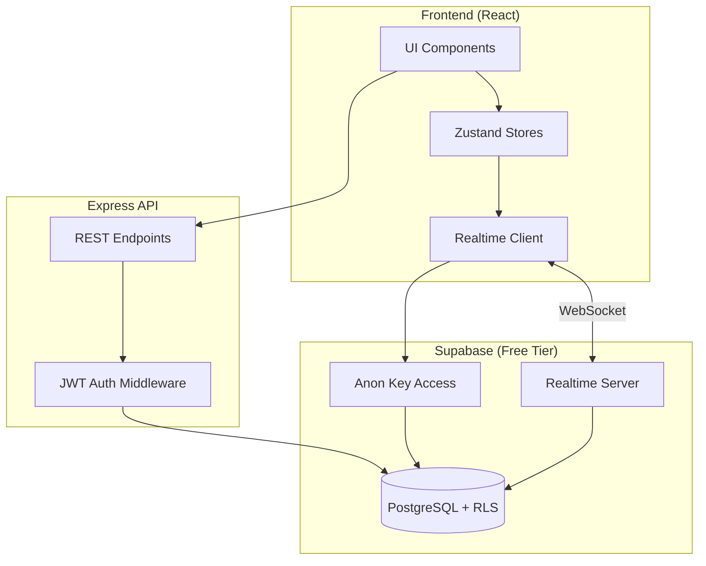

# Design Document: Supabase Enhancements

## Overview

This design implements three free Supabase features to enhance the Spooky Styles platform: Row Level Security (RLS) for database-level authorization, Realtime subscriptions for live inventory updates, and Realtime order notifications. All features leverage Supabase's free tier capabilities with no additional costs.

### Technology Stack

**Existing Stack (No Changes):**
- Frontend: React 18 + TypeScript
- Backend: Node.js + Express
- Database: Supabase PostgreSQL (already connected)
- Storage: AWS S3 (keeping as-is)

**New Additions:**
- `@supabase/supabase-js` - Supabase JavaScript client for Realtime
- Supabase RLS Policies - SQL policies for row-level security

## Architecture

### High-Level Architecture



### Security Model

**Two-Tier Security:**
1. **Application Layer**: Express API with JWT authentication (existing)
2. **Database Layer**: Supabase RLS policies (new)

This provides defense-in-depth - even if the API is compromised, RLS prevents unauthorized data access.

## Components and Interfaces

### 1. Row Level Security (RLS) Policies

**Responsibilities:**
- Enforce user-specific data access at the database level
- Prevent unauthorized access to orders, cart items, and user data
- Allow admin users full access to all data
- Deny access by default unless explicitly granted

**RLS Policy Structure:**

```sql
-- Enable RLS on sensitive tables
ALTER TABLE users ENABLE ROW LEVEL SECURITY;
ALTER TABLE orders ENABLE ROW LEVEL SECURITY;
ALTER TABLE order_items ENABLE ROW LEVEL SECURITY;
ALTER TABLE cart_items ENABLE ROW LEVEL SECURITY;

-- Policy: Users can only see their own data
CREATE POLICY "Users can view own data"
  ON users
  FOR SELECT
  USING (auth.uid()::text = id::text);

-- Policy: Users can only see their own orders
CREATE POLICY "Users can view own orders"
  ON orders
  FOR SELECT
  USING (auth.uid()::text = user_id::text);

-- Policy: Admins can see everything
CREATE POLICY "Admins have full access"
  ON orders
  FOR ALL
  USING (
    EXISTS (
      SELECT 1 FROM users
      WHERE users.id::text = auth.uid()::text
      AND users.is_admin = true
    )
  );
```

**JWT Integration:**
- Express API continues to issue JWT tokens
- JWT `sub` claim contains user ID
- Supabase RLS uses `auth.uid()` from JWT to filter rows
- Backend sets JWT in Supabase client for RLS enforcement

### 2. Realtime Inventory Updates

**Responsibilities:**
- Subscribe to product stock_quantity changes
- Broadcast updates to all connected clients
- Update UI immediately when inventory changes
- Handle connection failures gracefully

**Realtime Channel Structure:**

```typescript
interface RealtimeInventoryService {
  subscribeToProduct(productId: string, callback: (stock: number) => void): () => void;
  subscribeToAllProducts(callback: (updates: ProductUpdate[]) => void): () => void;
  unsubscribe(subscription: RealtimeSubscription): void;
}

interface ProductUpdate {
  id: string;
  stock_quantity: number;
  updated_at: string;
}
```

**Implementation Pattern:**

```typescript
import { createClient } from '@supabase/supabase-js';

const supabase = createClient(
  process.env.VITE_SUPABASE_URL!,
  process.env.VITE_SUPABASE_ANON_KEY!
);

// Subscribe to product inventory changes
const subscription = supabase
  .channel('product-inventory')
  .on(
    'postgres_changes',
    {
      event: 'UPDATE',
      schema: 'public',
      table: 'products',
      filter: `id=eq.${productId}`
    },
    (payload) => {
      const newStock = payload.new.stock_quantity;
      updateUI(newStock);
    }
  )
  .subscribe();

// Cleanup
subscription.unsubscribe();
```

**Frontend Integration:**

```typescript
// Custom hook for realtime inventory
export const useRealtimeInventory = (productId: string) => {
  const [stock, setStock] = useState<number | null>(null);
  const [isConnected, setIsConnected] = useState(false);

  useEffect(() => {
    const subscription = supabase
      .channel(`product-${productId}`)
      .on('postgres_changes', {
        event: 'UPDATE',
        schema: 'public',
        table: 'products',
        filter: `id=eq.${productId}`
      }, (payload) => {
        setStock(payload.new.stock_quantity);
      })
      .subscribe((status) => {
        setIsConnected(status === 'SUBSCRIBED');
      });

    return () => {
      subscription.unsubscribe();
    };
  }, [productId]);

  return { stock, isConnected };
};
```

### 3. Realtime Order Notifications

**Responsibilities:**
- Subscribe to order status changes for authenticated users
- Filter updates to only show user's own orders
- Display notifications when order status changes
- Unsubscribe when user navigates away

**Realtime Channel Structure:**

```typescript
interface RealtimeOrderService {
  subscribeToUserOrders(userId: string, callback: (order: Order) => void): () => void;
  subscribeToOrder(orderId: string, callback: (order: Order) => void): () => void;
  unsubscribe(subscription: RealtimeSubscription): void;
}

interface OrderUpdate {
  id: string;
  status: 'pending' | 'processing' | 'shipped' | 'delivered';
  updated_at: string;
}
```

**Implementation with RLS:**

```typescript
// Subscribe to user's orders (RLS automatically filters)
const subscription = supabase
  .channel('user-orders')
  .on(
    'postgres_changes',
    {
      event: 'UPDATE',
      schema: 'public',
      table: 'orders',
      // RLS policy ensures user only sees their own orders
    },
    (payload) => {
      const updatedOrder = payload.new;
      showNotification(`Order ${updatedOrder.id} is now ${updatedOrder.status}`);
    }
  )
  .subscribe();
```

**Frontend Integration:**

```typescript
// Custom hook for realtime orders
export const useRealtimeOrders = (userId: string) => {
  const [orders, setOrders] = useState<Order[]>([]);
  const [notifications, setNotifications] = useState<string[]>([]);

  useEffect(() => {
    // Set JWT for RLS
    supabase.auth.setSession({
      access_token: getJWTToken(),
      refresh_token: ''
    });

    const subscription = supabase
      .channel('my-orders')
      .on('postgres_changes', {
        event: 'UPDATE',
        schema: 'public',
        table: 'orders'
      }, (payload) => {
        const updatedOrder = payload.new as Order;
        
        // Update orders list
        setOrders(prev => 
          prev.map(o => o.id === updatedOrder.id ? updatedOrder : o)
        );
        
        // Show notification
        setNotifications(prev => [
          ...prev,
          `Order #${updatedOrder.id} status: ${updatedOrder.status}`
        ]);
      })
      .subscribe();

    return () => {
      subscription.unsubscribe();
    };
  }, [userId]);

  return { orders, notifications };
};
```

## Data Models

### RLS-Enabled Tables

```sql
-- Users table (already exists, add RLS)
ALTER TABLE users ENABLE ROW LEVEL SECURITY;

CREATE POLICY "users_select_own" ON users
  FOR SELECT USING (auth.uid()::text = id::text);

CREATE POLICY "users_update_own" ON users
  FOR UPDATE USING (auth.uid()::text = id::text);

-- Orders table (already exists, add RLS)
ALTER TABLE orders ENABLE ROW LEVEL SECURITY;

CREATE POLICY "orders_select_own" ON orders
  FOR SELECT USING (auth.uid()::text = user_id::text);

CREATE POLICY "orders_select_admin" ON orders
  FOR SELECT USING (
    EXISTS (
      SELECT 1 FROM users
      WHERE users.id::text = auth.uid()::text
      AND users.is_admin = true
    )
  );

CREATE POLICY "orders_update_admin" ON orders
  FOR UPDATE USING (
    EXISTS (
      SELECT 1 FROM users
      WHERE users.id::text = auth.uid()::text
      AND users.is_admin = true
    )
  );

-- Order Items table (already exists, add RLS)
ALTER TABLE order_items ENABLE ROW LEVEL SECURITY;

CREATE POLICY "order_items_select_own" ON order_items
  FOR SELECT USING (
    EXISTS (
      SELECT 1 FROM orders
      WHERE orders.id = order_items.order_id
      AND orders.user_id::text = auth.uid()::text
    )
  );

-- Cart Items table (already exists, add RLS)
ALTER TABLE cart_items ENABLE ROW LEVEL SECURITY;

CREATE POLICY "cart_items_all_own" ON cart_items
  FOR ALL USING (auth.uid()::text = user_id::text);

-- Products table (public read, admin write)
ALTER TABLE products ENABLE ROW LEVEL SECURITY;

CREATE POLICY "products_select_all" ON products
  FOR SELECT USING (true);

CREATE POLICY "products_modify_admin" ON products
  FOR ALL USING (
    EXISTS (
      SELECT 1 FROM users
      WHERE users.id::text = auth.uid()::text
      AND users.is_admin = true
    )
  );
```

### Realtime Configuration

```sql
-- Enable Realtime for specific tables
ALTER PUBLICATION supabase_realtime ADD TABLE products;
ALTER PUBLICATION supabase_realtime ADD TABLE orders;
ALTER PUBLICATION supabase_realtime ADD TABLE order_items;
```

## Error Handling

### RLS Policy Errors

```typescript
class RLSError extends Error {
  constructor(message: string) {
    super(`RLS Policy Violation: ${message}`);
    this.name = 'RLSError';
  }
}

// Handle RLS errors in API
try {
  const { data, error } = await supabase
    .from('orders')
    .select('*')
    .eq('id', orderId);
    
  if (error) {
    if (error.code === 'PGRST301') {
      throw new RLSError('Access denied to this resource');
    }
    throw error;
  }
} catch (error) {
  if (error instanceof RLSError) {
    return res.status(403).json({ error: error.message });
  }
  return res.status(500).json({ error: 'Internal server error' });
}
```

### Realtime Connection Errors

```typescript
const handleRealtimeError = (error: RealtimeError) => {
  console.error('Realtime error:', error);
  
  switch (error.type) {
    case 'CONNECTION_LOST':
      // Auto-reconnect handled by Supabase client
      showNotification('Connection lost. Reconnecting...');
      break;
    case 'SUBSCRIPTION_FAILED':
      showNotification('Failed to subscribe to updates');
      break;
    case 'UNAUTHORIZED':
      // JWT expired, refresh token
      refreshAuthToken();
      break;
    default:
      showNotification('Realtime update error');
  }
};

// Realtime with error handling
const subscription = supabase
  .channel('my-channel')
  .on('postgres_changes', config, callback)
  .subscribe((status, error) => {
    if (status === 'SUBSCRIBED') {
      console.log('Connected to realtime');
    } else if (status === 'CHANNEL_ERROR') {
      handleRealtimeError(error);
    }
  });
```

## Testing Strategy

### RLS Policy Testing

```typescript
describe('RLS Policies', () => {
  it('should prevent users from viewing other users orders', async () => {
    // User 1 creates order
    const order = await createOrder(user1Id);
    
    // User 2 tries to access it
    const { data, error } = await supabase
      .from('orders')
      .select('*')
      .eq('id', order.id)
      .single();
    
    expect(data).toBeNull();
    expect(error.code).toBe('PGRST301'); // RLS violation
  });
  
  it('should allow admins to view all orders', async () => {
    const order = await createOrder(user1Id);
    
    // Admin accesses it
    const { data, error } = await supabase
      .from('orders')
      .select('*')
      .eq('id', order.id)
      .single();
    
    expect(error).toBeNull();
    expect(data.id).toBe(order.id);
  });
});
```

### Realtime Testing

```typescript
describe('Realtime Inventory', () => {
  it('should receive stock updates in real-time', async () => {
    const updates: number[] = [];
    
    // Subscribe to product
    const subscription = supabase
      .channel('test-product')
      .on('postgres_changes', {
        event: 'UPDATE',
        schema: 'public',
        table: 'products',
        filter: `id=eq.${productId}`
      }, (payload) => {
        updates.push(payload.new.stock_quantity);
      })
      .subscribe();
    
    // Update stock
    await updateProductStock(productId, 50);
    
    // Wait for realtime update
    await wait(1000);
    
    expect(updates).toContain(50);
    
    subscription.unsubscribe();
  });
});
```

## Performance Optimization

### Realtime Connection Management

```typescript
// Connection pool for Realtime
class RealtimeConnectionManager {
  private channels: Map<string, RealtimeChannel> = new Map();
  
  subscribe(channelName: string, config: ChannelConfig) {
    // Reuse existing channel if available
    if (this.channels.has(channelName)) {
      return this.channels.get(channelName)!;
    }
    
    const channel = supabase.channel(channelName);
    this.channels.set(channelName, channel);
    
    return channel;
  }
  
  unsubscribe(channelName: string) {
    const channel = this.channels.get(channelName);
    if (channel) {
      channel.unsubscribe();
      this.channels.delete(channelName);
    }
  }
  
  cleanup() {
    this.channels.forEach(channel => channel.unsubscribe());
    this.channels.clear();
  }
}
```

### RLS Query Optimization

```sql
-- Add indexes for RLS policy performance
CREATE INDEX idx_orders_user_id ON orders(user_id);
CREATE INDEX idx_order_items_order_id ON order_items(order_id);
CREATE INDEX idx_users_is_admin ON users(is_admin) WHERE is_admin = true;
```

## Security Considerations

### JWT Token Management

```typescript
// Set JWT in Supabase client for RLS
export const setSupabaseAuth = (jwtToken: string) => {
  supabase.auth.setSession({
    access_token: jwtToken,
    refresh_token: '' // Not needed for RLS
  });
};

// Clear auth on logout
export const clearSupabaseAuth = () => {
  supabase.auth.signOut();
};
```

### RLS Best Practices

1. **Default Deny**: All tables have RLS enabled with no default access
2. **Explicit Grants**: Policies explicitly grant access based on user identity
3. **Admin Bypass**: Separate policies for admin users with full access
4. **Service Role**: Backend uses service role key for admin operations
5. **Anon Key**: Frontend uses anon key with RLS enforcement

### Realtime Security

```typescript
// Realtime automatically respects RLS policies
// Users only receive updates for rows they can access

// Example: User only gets their own order updates
const subscription = supabase
  .channel('my-orders')
  .on('postgres_changes', {
    event: 'UPDATE',
    schema: 'public',
    table: 'orders'
    // No filter needed - RLS handles it
  }, callback)
  .subscribe();
```

## Deployment

### Environment Variables

```bash
# Frontend (.env)
VITE_SUPABASE_URL=https://your-project.supabase.co
VITE_SUPABASE_ANON_KEY=your-anon-key

# Backend (.env)
SUPABASE_URL=https://your-project.supabase.co
SUPABASE_SERVICE_ROLE_KEY=your-service-role-key
```

### Migration Steps

1. **Enable RLS on tables** (run SQL migrations)
2. **Create RLS policies** (run policy SQL)
3. **Enable Realtime** (configure in Supabase dashboard)
4. **Install Supabase client** (`npm install @supabase/supabase-js`)
5. **Update frontend** (add Realtime hooks)
6. **Test RLS policies** (verify access control)
7. **Monitor Realtime** (check connection count)

### Monitoring

**Free Tier Limits:**
- Realtime: 200 concurrent connections
- Database: 500 MB storage
- Bandwidth: 5 GB/month

**Monitoring Dashboard:**
- Track Realtime connection count
- Monitor RLS policy performance
- Check database query times
- Alert if approaching limits

## Cost Analysis

**Total Cost: $0/month**

All features use Supabase free tier:
- ✅ RLS: Free (built into PostgreSQL)
- ✅ Realtime: Free up to 200 concurrent connections
- ✅ Database: Free up to 500 MB
- ✅ API requests: Unlimited on free tier

**Scaling Considerations:**
- If you exceed 200 concurrent Realtime connections, upgrade to Pro ($25/month)
- Current usage: ~10-50 concurrent users expected
- Plenty of headroom on free tier
